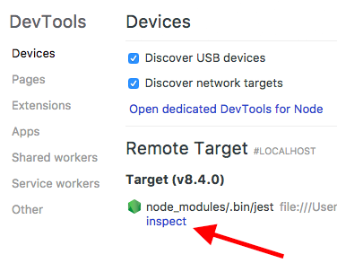
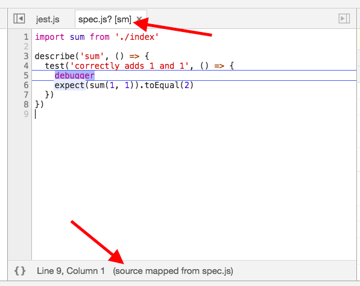
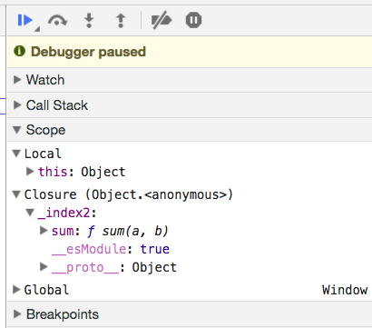
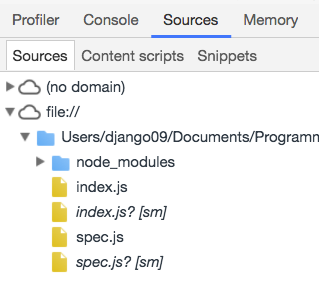
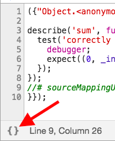

Not so long ago, I decided to add some tests to a small program I wrote. I chose [jest](https://facebook.github.io/jest/), a nice testing platform by facebook that I've enjoyed using in the past. This time, however, I had some trouble: I ran into a babel-related error with my very first test. I'd like to be a world-class debugger someday, so I figured I'd dig in and really try to understand the error.

This post describes how to set up a little app that reproduces the error, and next, how to debug the error using tools from the modern JavaScript toolbox.

## Reproducing the Error

(If you'd like, you can skip this section and reproduce the error by cloning this [repository](https://github.com/nwshane/jest-babel-error).)

In order to get jest to show us this babel-related error, we'll do the following things:

1. Write a sum function that we will test.
2. Write a simple jest test for the sum function.
3. Create an npm `test` script to run our tests.
4. Install jest.
5. Configure babel to recognize ES2015 imports.

Let's start out by creating that sum function.

```javascript
// index.js
export const sum = (a, b) => (a + b)
```

Simple enough. Now we want to test our sum function, because we're responsible devs, and that's what responsible devs do.

```javascript
// spec.js
import sum from './index'

describe('sum', () => {
  test('correctly adds 1 and 1', () => {
    expect(sum(1, 1)).toEqual(2)
  })
})
```

(If you saw the bug in this code, then good for you! If not, then that's fine—I didn't see it either, so I had to learn how to debug it.)

Two more steps until we can run our tests. First, we'll create a `package.json` file containing our `test` script, which will run jest. Run `npm init`, and answer the `test command` prompt with `jest` (you can use the defaults for everything else).

Finally, we install jest with `npm i jest`.

Hurray! We now run the test script with `npm t` (a shortcut for `npm test`, or `npm run test`), and we see...

```
Test suite failed to run

SyntaxError: Unexpected token import

at ScriptTransformer._transformAndBuildScript (node_modules/jest-runtime/build/script_transformer.js:305:17)
          at Generator.next (<anonymous>)
          at Promise (<anonymous>)
```

Dang! It looks like jest doesn't understand the [ES2015 import](https://developer.mozilla.org/en-US/docs/Web/JavaScript/Reference/Statements/import) syntax. That's okay, we just need to install [babel](https://babeljs.io/) and the [ES2015 babel preset](https://babeljs.io/docs/plugins/preset-es2015/), which jest will use to transform the import syntax into something it understands.

Jest's documentation on [configuring babel](https://facebook.github.io/jest/docs/en/getting-started.html#using-babel) is a bit complicated with a number of side notes. Long story short, jest comes with a library called [babel-jest](https://github.com/facebook/jest/tree/master/packages/babel-jest), so all we have to do to make jest understand our `import` syntax is the following:

1. Add a `.babelrc` file to our project:

```json
{
  "presets": ["es2015"]
}
```

2. Install the ES2015 preset: `npm i babel-preset-es2015`

With that done, babel should be good to go.

## Debugging our Babel-Related Error

Running our tests again (`npm t`), we get a more cryptic error this time:

```
FAIL  ./spec.js
 sum
   ✕ correctly adds 1 and 1 (4ms)

 ● sum › correctly adds 1 and 1

   TypeError: (0 , _index2.default) is not a function

     at Object.<anonymous> (spec.js:5:32)
         at Promise (<anonymous>)
         at <anonymous>
```

Hey, at least our test suite is running now!

If you don't have a lot of experience with babel, then this error will seem a bit strange. Where in the world did `_index2.default` come from? Who cares if it's not a function—I didn't write anything like that in my code!

Hold on a moment. Let's try to remember what babel is doing. Babel is a transpiler, so it's transforming your code into something that jest can understand. Does that mean it might be transforming variable names as well, and outputting things like `_index2.default`?

In order to answer that question, let's consult a handy section of the jest docs, aptly named, "[Tests are Failing and You Don't Know Why](https://facebook.github.io/jest/docs/en/troubleshooting.html#tests-are-failing-and-you-don-t-know-why)". The docs recommend we use a debugger, which seems like a great idea for getting more info!

Let's add a `debugger` line into our code, to tell our debugging tool to stop at that line:

```javascript
import sum from './index'

describe('sum', () => {
  test('correctly adds 1 and 1', () => {
    debugger
    expect(sum(1, 1)).toEqual(2)
  })
})
```

Next, let's run our tests as recommended by the docs:

```
node --inspect-brk node_modules/.bin/jest --runInBand
```

This gives us the following output:

```
Debugger listening on ws://127.0.0.1:9229/cedc923a-cc9f-4531-a947-9c1ef7226bc8
For help see https://nodejs.org/en/docs/inspector
```

Looking at the above link, we can see a bunch of different options for debugging our code. Let's use Chrome, since most of us will have it installed already.

1. Navigate to `chrome://inspect/` in Chrome.
2. In the `Remote Target` section, you should see the script `node_modules/.bin/jest`. Click the `inspect` link below it.



3. Cool! Looks like a debugger! `--inspect-brk` pauses code execution at the first line of the script, so we've stopped at the first line of the jest script file. To get to our debugger line, let's press the play button.

After a little wait, our `spec.js` file will open and you'll see our sum test containing the `debugger` line.

`_index2.default` is still no where in sight, but that's because we're looking at the "Source Map" of our code—that is, the original code that we wrote. Chrome shows this to us in a couple places:



Generally, it's much nicer to look at the Source Map of some code than its transpiled version, which is why Chrome shows it to us. However, we're interested to see whether our transpiled code contains `_index2.default`, so we need to go beyond the source map.

First, let's look in the Scope section of the debugging window. Scope contains all the variables that are accessible where we paused our code with `debugger`, and notably it shows us variables from our *transpiled* code, which is what we want to see. Taking a look around, we open up the `Closure` object, and... there's `_index2`! Open that up, and we see a `sum` property, but no `default` property.



But where is `_index2` coming from? And where is `_index2.default` being called? Clearly we need to see the actual transpiled code, not just its representation in the debugger. We can access the transpiled files in the Sources file tree, as seen here:



We then "pretty-print" the transpiled code to improve its readability:



And we see the transpiled code in all its glory:

```
({
    "Object.<anonymous>": function(module, exports, require, __dirname, __filename, global, jest) {
        'use strict';
        var _index = require('./index');
        var _index2 = _interopRequireDefault(_index);
        function _interopRequireDefault(obj) {
            return obj && obj.__esModule ? obj : {
                default: obj
            };
        }

        describe('sum', function() {
            test('correctly adds 1 and 1', function() {
                debugger ;expect((0,
                _index2.default)(1, 1)).toEqual(2);
            });
        });
        //# sourceMappingURL=...
    }
});
```

Without getting too much into the details of babel's output, we can now see that `_index2` refers to an object containing the default import, and that `_index2.default` is used in our test in the place of `sum`.

So wait, what was our original error again?

```
FAIL  ./spec.js
 sum
   ✕ correctly adds 1 and 1 (4ms)

 ● sum › correctly adds 1 and 1

   TypeError: (0 , _index2.default) is not a function

     at Object.<anonymous> (spec.js:5:32)
         at Promise (<anonymous>)
         at <anonymous>
```

Now this error makes sense. `_index2.default` isn't a function because it's undefined, as we saw when we looked in the `_index2` object in the Debugger Scope. `_index2` has a `sum` property and no `default` property. We seem to be accessing the `sum` function in the wrong way, so let's check out how we're importing and exporting the function:

```javascript
// index.js
export const sum = (a, b) => (a + b)

// spec.js
import sum from './index'
```

Ah-ha! We're exporting sum as a named variable and importing it as the default. To fix this error, we can either change the named export into a default export or change the default import into a named import. Let's do the former:

```javascript
// index.js
export default (a, b) => (a + b)

// spec.js
import sum from './index'
```

Now we run `npm t` once again, and we get...

```
PASS  ./spec.js
 sum
   ✓ correctly adds 1 and 1 (5ms)

Test Suites: 1 passed, 1 total
Tests:       1 passed, 1 total
Snapshots:   0 total
Time:        1.602s
Ran all test suites.
```

*Passing tests = pure bliss*

And now we can feel extra happy, because we debugged the error, we understand where it's coming from, and we'll be unfazed if we see it again.

The takeaway from this debugging round is... do your best to deeply understand errors in your code! If you think you understand an error, but you're not sure, it can help to write down any questions about the error that are floating around your head. Then you can methodically tackle each question and improve your debugging skills. This is a strategy that I'm learning myself, and I hope it proves useful to you.
