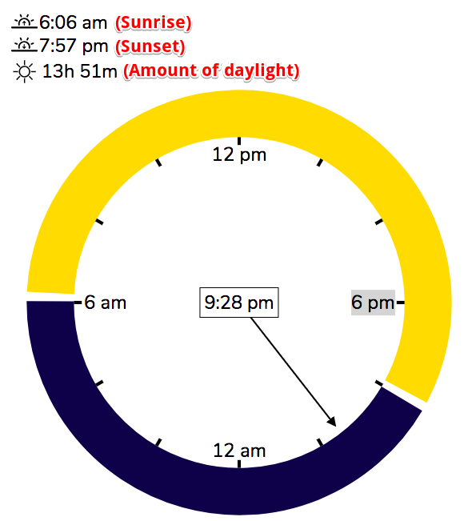

As some of you know, I've been hard at work on a side project for the past half year or so. I call it the "Sun Clock", and I'm happy to say that the [first version](https://sunclock.nathanshane.me) is finished!

The original idea behind the sun clock was to show the amount of daylight vs. nighttime at the user's location. I live in Brooklyn, New York, and it's _absolutely essential_ that I know when the sun is going to set. (How else would I plan evening picnics in nearby Prospect Park?)

With the sun clock, I can click "Show My Location" in the bottom right, and voila—the sunrise and sunset times appear in the top-left corner. You have to allow the Sun Clock to access your location, and then wait for your location to load, before "Show My Location" will appear.

The yellow and black circle represents the 24 hours of the day (unlike the 12 hours of a typical clock), with noon at the top and midnight at the bottom. Using a 24-hour clock allows one to see at a glance how much of the day is in light and how much in darkness.

I finished this initial version of the sun clock many moons ago (so to speak) and I found myself spurred on to take the visualization a bit farther. What about viewing different locations around the world, and on different dates throughout the year? I was curious how the clock might look in Estonia on January 3rd (which is when I visited my friend Tengo there a few years back), or in Greenland mid-summer. So I added a date picker to the bottom left of the screen, and a list of selectable/searchable locations to the bottom right.[1](#footnote-1)

Turns out Qaanaaq, a town in northwestern Greenland, is a sunny place in the summer!

Your first time looking at the sun clock, you might have the impression that it's just a fixed image, with no movement. But that's not the case! The hand of the clock is moving, just _verrrryyyy sloooooowllllyyyy_. It has 24 hours to make a full rotation, which on my laptop screen means that the clock hand has to travel 0.68 inches/hour.[2](#footnote-2)

When the clock was only partly finished, I had an intriguing thought: what would it look like if I could _speed it up_? So I added a slider below the date picker, which lets you do just that:

Speeding up the clock to multiple days per second made the hour hand's previously unnoticeable progression around the circle into a top-speed, frenetic, and distracting movement. To fix that problem, I borrowed an idea from real life clocks, which depict 12 hours, 60 minutes, and 60 seconds all at the same time. When you increase the speed of the sun clock past one day/second, the clock moves into "year mode": it continues to represent daylight and nighttime as portions of a 24 hour circle, but shows a day hand instead of an hour hand, which points to the winter solstice at the bottom and the summer solstice at the top. The time of day in the center of the circle is also replaced by the date.

If you were thinking of moving to Greenland to take in the sun, I recommend only doing so for part of the year:

Making it so easy to speed up the clock made me feel a little off kilter, so I added a button to instantly reset time and slow things down (to the right of the date picker). Combine that with the "Show My Location" button, and you're back to the here and now. 🧘‍♂️🧘

...and that's about it! I have many ideas on how to improve the clock in the future, if I decide I want to return to it. I'd like to make it mobile-friendly, add keyboard shortcuts, create a tutorial mode to walk you through the controls, and much more. For now, though, I'll be limiting my work to fixing bugs (so please let me know if you see any problems!).

It's been fun to show my friends and family the clock and observe what they've used it for: My mom checked January in New Zealand to plan for a potential upcoming trip, while my dad geeked out at the wildly varying sunrise and sunset times in St. Petersburg throughout the year. If you find it useful, or just have fun with it, I'll be happy if you share it around!

Thanks for reading this far, and don't forget to get outside and soak up the sun every once in a while ;)

### Footnotes

<a name="footnote-1">1. I also changed the clock to show a random location when it loads (assuming that no location is specified in the URL). I made this change because the sun clock can only work once it knows what latitude and longitude to use, and choosing a random location gives it that information immediately. I would love to show the location of the user as the default, but then the clock has to wait for the browser to "geolocate" the user (find their latitude and longitude), which can sometimes be extremely slow.</a>

<a name="footnote-2">2. On my laptop screen, which is 11.3 x 7 inches, the clock hand has an approximate radius of 2.6 inches. Circumference = 16.3 inches; speed of movement = 16.3 inches / 24 hours, or 0.68 in/hr.</a>
